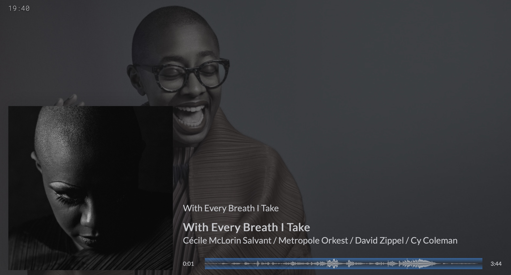
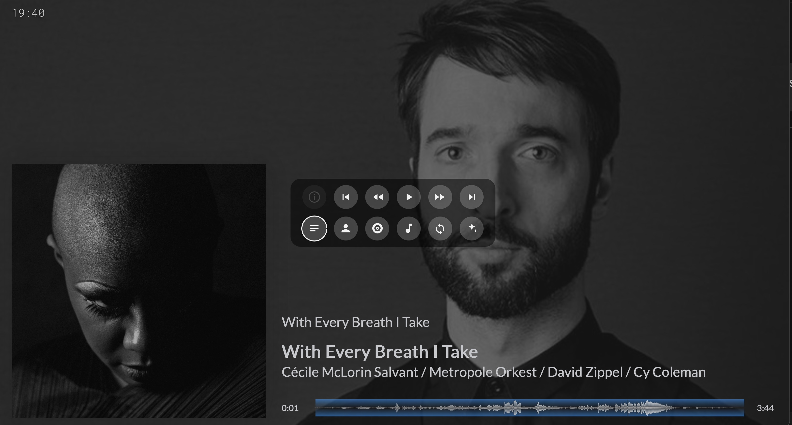
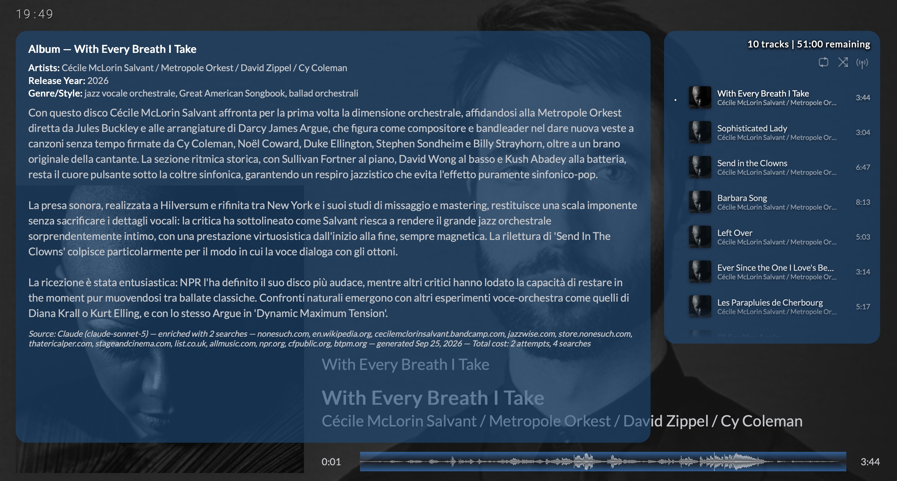
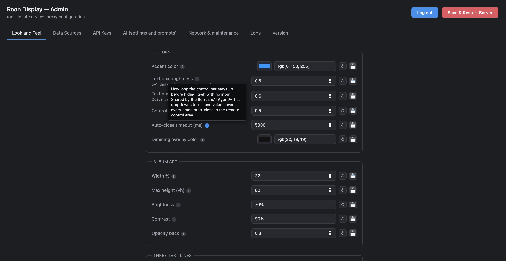

# Roon-display-Aria

Custom Roon Now Playing display for Google TV/Chromecast, with AI-generated album, composition, and artist write-ups (Claude/ChatGPT), Discogs/iTunes/Deezer artwork lookup, a clock and animated waveform, and a local Node proxy with an admin panel — auto-restores itself after every Roon Server update.

Not affiliated with or endorsed by Roon Labs.

| Now Playing | Remote controls |
| :---: | :---: |
|  |  |
| **AI album write-up + queue** | **Admin utility** |
|  |  |

## What this is

Roon's own Google TV display is functional but bare. This project replaces it with a richer one:

- **AI write-ups** — on-demand album reviews, track/composition notes, and artist bios, generated by Claude or ChatGPT and shown right on the display
- **Artwork + metadata** — cover art and details pulled from Discogs, iTunes, and Deezer (configurable order/fallback)
- **Clock** — 24h or 12h, optional date, on-screen
- **Animated waveform** — replaces the plain progress bar
- **Admin panel** — a local web page (`/config`) to tune colors, layout, fonts, data sources, and AI settings, with restore-to-default and backup/export built in
- **Self-healing** — a background guardian detects when a Roon Server update wipes out the customized display files and restores them automatically, no manual redeploy needed

## How it's structured

- `display_ui.html` / `display_ui.js` — deployed **inside** Roon Server's own app bundle (overwritten by Roon updates; the guardian below restores them)
- `roon-local-services/` — a small Node/Express proxy that runs **outside** Roon's app bundle, so it survives updates untouched. Handles Discogs/AI API calls, the admin panel, and the auto-restore guardian.

## Requirements

- A Mac running Roon Server, with the Google TV/Chromecast display extension already in use
- [Node.js](https://nodejs.org/) (for the local proxy)
- API keys for whichever you want to use: a Discogs token, an Anthropic (Claude) key, and/or an OpenAI key — all optional, added later from the admin panel

## Installation

1. Download this repository.
2. Double-click **`Install Roon Display.command`** (no Terminal needed). First run: right-click → Open once, to clear macOS's "unidentified developer" warning.
3. Open the admin panel (the installer prints the URL, typically `http://<this-Mac's-IP>:3001/config`) and add your API keys under **API Keys**.

Full step-by-step instructions, the admin panel's tabs, troubleshooting, manual setup (without the installer), and how updates/rollback work are all in **[`roon-local-services/deployment.md`](roon-local-services/deployment.md)**.

## Uninstalling

Double-click **`Uninstall Roon Display.command`** — see `deployment.md` for exactly what it removes.

## License

[PolyForm Noncommercial License 1.0.0](LICENSE) — free to use, modify, and redistribute for any noncommercial purpose. Commercial use of this software, or of anything built on it, is not permitted.
